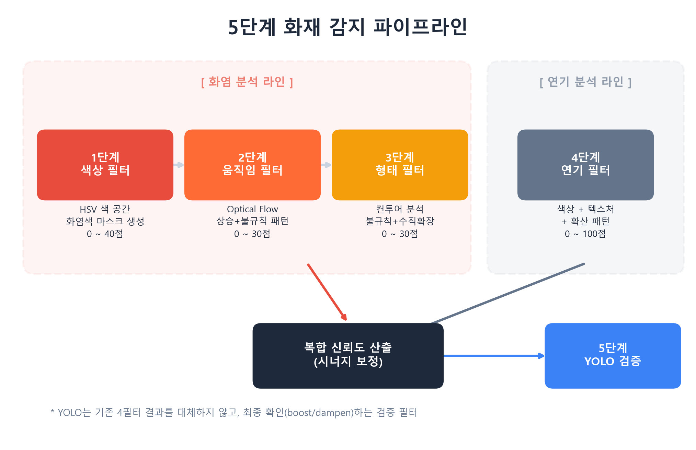
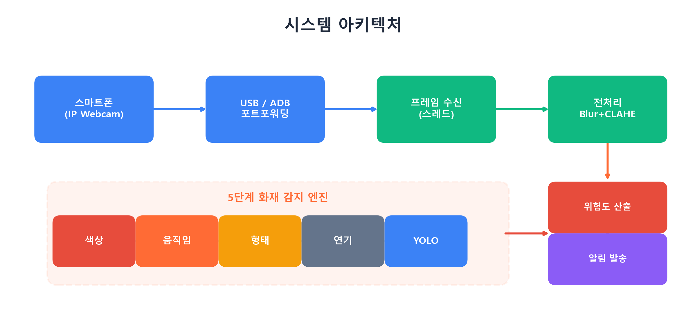
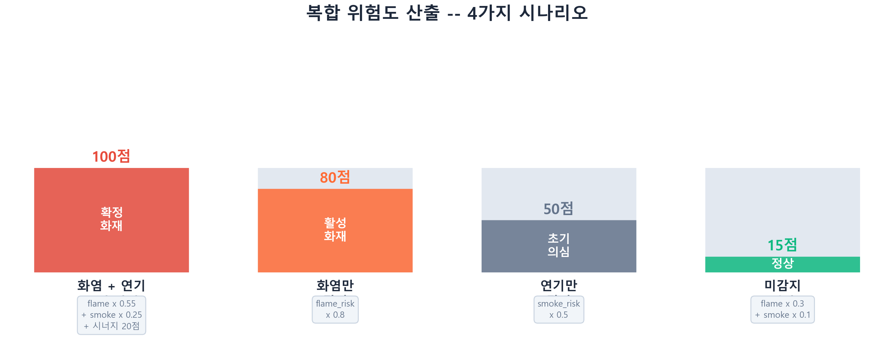
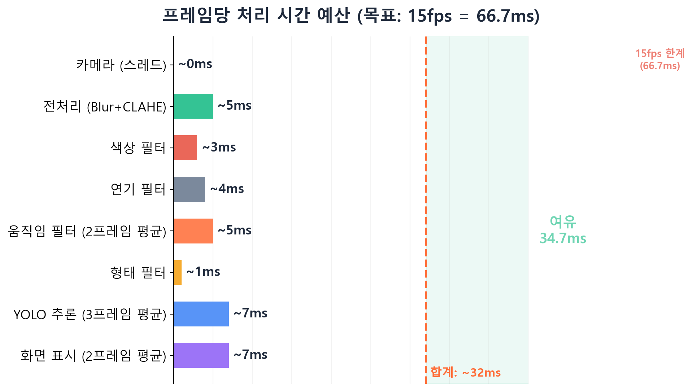

# 제조 현장 화재 감지 시스템

<p align="center">
  
</p>

<p align="center">
  <b>CV 4단계 필터링 + YOLOv8 AI 검증 | 실시간 15fps | USB/ADB 카메라 | 단일 EXE 배포</b>
</p>

<p align="center">
  
  
  
  
  
</p>

---

## 개요

제조 현장을 위한 실시간 화재 감지 시스템. **4개의 컴퓨터 비전 필터**(색상, 움직임, 형태, 연기)와 **YOLOv8 AI 검증**을 결합하여 높은 정확도와 낮은 오탐률을 동시에 달성한다.

스마트폰 카메라로부터 **USB/ADB 포트포워딩**(네트워크 지연 없음)으로 영상을 수신하고, 각 프레임을 5단계 파이프라인으로 처리하여 화재 감지 시 Slack, 이메일, 경보음으로 알림을 전송한다.

### 주요 기능

| 기능 | 설명 |
|---|---|
| **5단계 하이브리드 감지** | CV 필터 + YOLO AI 교차 검증으로 높은 정확도 |
| **실시간 15fps** | 스레드 프레임 리더 + N프레임 간격 최적화 |
| **USB 카메라 (ADB)** | 포트포워딩으로 네트워크 지연 제거 |
| **4단계 알림 시스템** | Normal / Warning / Alert / Critical + Slack, 이메일, 경보음, 영상 |
| **오탐 방지** | 3중 방어: 필터 단계, 엔진 단계, 시스템 단계 |
| **단일 EXE 배포** | PyInstaller 패키징 (GPU 지원 포함) |

---

## 시스템 아키텍처

<p align="center">
  
</p>

```
스마트폰 (IP Webcam)  ──USB/ADB──>  스레드 프레임 리더  ──>  전처리 (Blur + CLAHE)
                                                                     │
                                                                     v
                                      ┌──────────────────────────────────────────────┐
                                      │          5단계 화재 감지 엔진                  │
                                      │  색상 → 움직임 → 형태 → 연기 → YOLO            │
                                      └──────────────────────┬───────────────────────┘
                                                             │
                                                             v
                                                  신뢰도 점수 (0-100)
                                                             │
                                                             v
                                                  알림 시스템 (Slack/이메일/경보음)
```

---

## 5단계 감지 파이프라인

### 1~3단계: 화염 분석

| 단계 | 필터 | 방법 | 점수 |
|:---:|---|---|:---:|
| 1 | **색상 필터** | HSV 색공간 화염 마스크 + 모폴로지 + 피부/조명 제외 | 0-40 |
| 2 | **움직임 필터** | Farneback Optical Flow + 상향 불규칙 움직임 감지 | 0-30 |
| 3 | **형태 필터** | 윤곽선 불규칙도 + 수직 확장 + 색상 그래디언트 | 0-30 |

**화염 위험도** = 색상(x0.4) + 움직임(x0.3) + 형태(x0.3) → 0-100 스케일로 정규화

### 4단계: 연기 분석 (독립)

| 단계 | 필터 | 방법 | 점수 |
|:---:|---|---|:---:|
| 4 | **연기 필터** | HSV 무채색 마스크 + Laplacian 텍스처 + 확산 패턴 | 0-100 |

### 5단계: YOLO AI 검증

| 단계 | 필터 | 방법 | 보정 |
|:---:|---|---|:---:|
| 5 | **YOLOv8n** | 화재/연기 객체 탐지 (6.2MB 모델, GPU ~33ms) | -25 ~ +25 |

> YOLO는 기존 필터를 **대체하지 않는다**. 최종 검증자로서 신뢰도 점수를 상향 또는 하향 보정한다.

| YOLO 결과 | 조건 | 동작 |
|---|---|---|
| 화재 감지 (conf >= 0.4) | -- | +25점 (상향) |
| 연기만 감지 | -- | +10점 (상향) |
| 미감지 | 기존 점수 >= 15 | x0.75 (25% 하향) |
| 미감지 | 기존 점수 < 15 | 변동 없음 |

---

## 신뢰도 계산

<p align="center">
  
</p>

| 시나리오 | 공식 | 최대 점수 |
|---|---|:---:|
| 화염 + 연기 (동시 감지) | flame x 0.55 + smoke x 0.25 + 시너지 보너스 20 | 100 |
| 화염만 감지 | flame_risk x 0.8 | 80 |
| 연기만 감지 | smoke_risk x 0.5 | 50 |
| 미감지 | flame x 0.3 + smoke x 0.1 | ~15 |

### 알림 레벨

| 레벨 | 신뢰도 | 상태 | 동작 |
|---|:---:|---|---|
| **Normal** | 0 - 29 | 모니터링 | 화면 표시만 (녹색) |
| **Warning** | 30 - 44 | 주의 | 콘솔 로그 (노란색) |
| **Alert** | 45 - 64 | 화재 의심 | Slack + 스냅샷 (주황색) |
| **Critical** | 65 - 100 | 화재 확인 | Slack + 이메일 + 경보음 + 영상 (빨간색) |

---

## 성능

<p align="center">
  
</p>

| 컴포넌트 | 시간 | 최적화 |
|---|:---:|---|
| 카메라 (스레드) | ~0ms | 백그라운드 스레드, 즉시 반환 |
| 전처리 | ~5ms | Gaussian Blur + CLAHE (V채널) |
| 색상 필터 | ~3ms | HSV 마스크 + 모폴로지 |
| 연기 필터 | ~4ms | Laplacian + 누적 확산 |
| 움직임 필터 (평균) | ~5ms | 2프레임 간격 + 0.5x 다운스케일 |
| 형태 필터 | ~1ms | 상위 5개 윤곽선만 |
| YOLO (평균) | ~7ms | 3프레임 간격 + GPU (33ms → 평균 7ms) |
| 화면 표시 (평균) | ~7ms | 2프레임 간격 imshow |
| **합계** | **~32ms** | **예산: 66.7ms (15fps) — 34.7ms 여유** |

### 주요 최적화 기법

- **스레드 MJPEG 리더**: 데몬 스레드가 프레임을 지속 디코딩, `read_frame()` 즉시 반환 (~0ms)
- **N프레임 간격 처리**: Optical Flow 2프레임, YOLO 3프레임, imshow 2프레임마다 실행
- **0.5x 다운스케일**: Optical Flow를 절반 해상도로 실행 (연산량 1/4)
- **스트림 자동 갱신**: 5분마다 TCP 재연결로 MJPEG 버퍼 누적 방지

---

## 기술 스택

| 분류 | 기술 | 상세 |
|---|---|---|
| 영상 처리 | OpenCV 4.x | 프레임 캡처, 전처리, CV 필터 |
| AI 모델 | YOLOv8n (Ultralytics) | 화재/연기 탐지, 6.2MB, 2클래스 |
| GPU | PyTorch + CUDA 12.4 | GTX 1050 추론 (~33ms/프레임) |
| 카메라 | IP Webcam + ADB | USB 포트포워딩, MJPEG 스트림 |
| 알림 | Slack API, SMTP | 웹훅 알림, 이메일 발송 |
| 배포 | PyInstaller | GPU 지원 포함 단일 EXE |
| 언어 | Python 3.12 | CUDA 호환 버전 |

---

## 프로젝트 구조

```
fire-detection-system/
├── main.py                          # 메인 실행 파일
├── fire_detection.spec              # PyInstaller 빌드 스펙
│
├── config/
│   ├── camera_config.yaml           # 카메라 연결 설정
│   ├── detection_config.yaml        # 필터 파라미터 및 임계값
│   └── alert_config.yaml            # 알림 레벨 및 알림 설정
│
├── src/
│   ├── core/
│   │   ├── camera_loader.py         # 스레드 MJPEG 리더 + ADB 포워딩
│   │   ├── detector.py              # 화재 감지 엔진 (5필터 + 신뢰도)
│   │   └── image_processor.py       # 전처리 (Gaussian Blur + CLAHE)
│   │
│   ├── filters/
│   │   ├── color_filter.py          # HSV 색상 기반 화염 감지 (0-40점)
│   │   ├── motion_filter.py         # Optical Flow 움직임 분석 (0-30점)
│   │   ├── shape_filter.py          # 윤곽선 형태 분석 (0-30점)
│   │   ├── smoke_filter.py          # 연기 감지 (색상+텍스처+확산)
│   │   └── yolo_filter.py           # YOLOv8 AI 검증 필터
│   │
│   ├── alert/
│   │   ├── alert_manager.py         # 알림 동작 관리자
│   │   ├── logger.py                # 이벤트 로깅 + 스냅샷/영상 저장
│   │   └── notifier.py              # Slack 웹훅, SMTP 이메일, 경보음
│   │
│   └── utils/
│       ├── visualizer.py            # 실시간 오버레이 + YOLO 바운딩박스
│       ├── performance_monitor.py   # FPS/지연시간 측정 (O(1) 누적)
│       └── roi_manager.py           # 관심 영역(ROI) 관리
│
├── models/
│   └── yolov8n-fire.pt              # 사전학습된 화재/연기 YOLO 모델 (6.2MB)
│
├── platform-tools/
│   └── adb.exe                      # Android Debug Bridge (USB 포워딩용)
│
├── logs/                            # 감지 이벤트, 스냅샷, 영상 클립
├── assets/                          # 다이어그램 및 차트
└── dist/                            # 빌드된 EXE 출력
    └── FireDetectionSystem/
        └── FireDetectionSystem.exe
```

---

## 시작하기

### 사전 요구사항

| 항목 | 요구사항 |
|---|---|
| **OS** | Windows 10/11 |
| **GPU** | CUDA 지원 NVIDIA GPU (테스트: GTX 1050) |
| **Python** | 3.12 (CUDA 12.4 호환에 필요) |
| **스마트폰** | [IP Webcam](https://play.google.com/store/apps/details?id=com.pas.webcam) 앱이 설치된 Android |
| **USB 케이블** | ADB 포트포워딩용 |

### 설치

```bash
# 1. 저장소 클론
git clone https://github.com/your-repo/fire-detection-system.git
cd fire-detection-system

# 2. 의존성 설치
pip install opencv-python numpy PyYAML requests pillow
pip install torch torchvision --index-url https://download.pytorch.org/whl/cu124
pip install ultralytics
pip install slack-sdk  # 선택: Slack 알림용

# 3. GPU 확인
python -c "import torch; print(f'CUDA: {torch.cuda.is_available()}, GPU: {torch.cuda.get_device_name(0)}')"
```

### 실행

```bash
# 1. 스마트폰을 USB로 연결 (USB 디버깅 ON)
# 2. 스마트폰에서 IP Webcam 앱 실행 → 서버 시작 (포트 8080)

# 3. 시스템 실행
python main.py

# 4. Q키로 종료
```

### EXE 빌드

```bash
# PyInstaller로 빌드 (Python 3.12 사용)
pyinstaller fire_detection.spec --noconfirm

# 출력: dist/FireDetectionSystem/FireDetectionSystem.exe
```

---

## 설정

### `config/camera_config.yaml`

```yaml
camera:
  type: usb_adb           # ADB 포트포워딩을 통한 USB 연결
  smartphone:
    port: 8080             # IP Webcam 앱 포트
  processing:
    target_resolution: [480, 360]
    target_fps: 15
```

### `config/detection_config.yaml`

```yaml
color_filter:
  hsv_ranges:
    flame_lower: [0, 80, 180]
    flame_upper: [25, 255, 255]
  max_score: 40

motion_filter:
  optical_flow_threshold: 2.5
  frame_interval: 2          # 2프레임마다 실행
  scale_factor: 0.5          # 0.5x 다운스케일

yolo_filter:
  enabled: true
  model_path: "models/yolov8n-fire.pt"
  confidence_threshold: 0.4
  frame_interval: 3          # 3프레임마다 실행

detection:
  consecutive_frames: 3      # 연속 3프레임 감지 필요
  debounce_seconds: 30       # 중복 알림 쿨다운
```

### `config/alert_config.yaml`

```yaml
alert:
  levels:
    warning:   { threshold: 30, actions: ["log"] }
    alert:     { threshold: 45, actions: ["log", "slack", "snapshot"] }
    critical:  { threshold: 65, actions: ["log", "slack", "email", "sound", "video"] }

  slack:
    enabled: true
    webhook_url: "https://hooks.slack.com/services/YOUR/WEBHOOK/URL"
```

---

## 오탐 방지 메커니즘

3중 방어 체계를 통해 오탐을 최소화한다.

### 1단계: 필터 수준

- 색상 필터: 고휘도/저채도 조명 영역 제외
- 피부색 차감 (H:5-17 범위): 인체 오탐 방지
- 움직임 필터: 규칙적/주기적 움직임 거부 (낮은 분산)
- 형태 필터: 직사각형/정형 객체 제외

### 2단계: 엔진 수준

- **연속 프레임 검증**: 3프레임 이상 연속 감지 필요
- **독립적 화염/연기 분석**: 시너지 기반 복합 점수 산출
- **YOLO 교차 검증**: CV 감지 + AI 미감지 = 25% 점수 하향

### 3단계: 시스템 수준

- **알림 디바운스**: 30초 중복 알림 쿨다운
- **ROI 영역**: 관심 영역 밖 감지 무시
- **단계적 대응**: 낮은 레벨은 로그만 기록 (알림 스팸 방지)

---

## 향후 계획

- [ ] 다중 카메라 지원 (RTSP/IP 카메라)
- [ ] 웹 대시보드 (Flask/FastAPI)
- [ ] 커스텀 YOLO 모델 학습 (정확도 향상)
- [ ] 열화상 카메라 연동
- [ ] 엣지 디바이스 최적화 (Jetson Nano)
- [ ] 클라우드 모니터링 및 원격 접근

---

## 라이선스

이 프로젝트는 MIT 라이선스를 따른다.

---

## 참고 자료

- [Ultralytics YOLOv8](https://github.com/ultralytics/ultralytics)
- [OpenCV Documentation](https://docs.opencv.org/)
- [tobybreckon/fire-detection-cnn](https://github.com/tobybreckon/fire-detection-cnn)
- [spacewalk01/yolov5-fire-detection](https://github.com/spacewalk01/yolov5-fire-detection)
